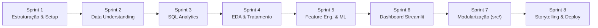

# 🗺️ Roadmap de Desenvolvimento — EduDataBR

Guia de planejamento, evolução e acompanhamento das etapas de desenvolvimento do projeto **EduDataBR**.

---

## 📊 Visão Geral do Ciclo de Vida do Projeto

---

## 📌 Status Consolidado das Sprints

| Sprint | Nome | Foco Principal | Status |
|---|---|---|:---:|
| **Sprint 1** | Estruturação e Ambiente | Configuração de ambiente, Git, PostgreSQL e obtenção dos dados | ✅ Concluída |
| **Sprint 2** | Entendimento dos Dados (Data Understanding) | Dicionário de dados, perguntas de negócio, hipóteses e qualidade | ✅ Concluída |
| **Sprint 3** | Engenharia & SQL Analytics | Carga no PostgreSQL, índices, views analíticas e queries avançadas | ✅ Concluída |
| **Sprint 4** | Limpeza & Análise Exploratória (EDA) | Tratamento fino, formato parquet, estatística descritiva e gráficos | 🟡 **Em Andamento** *(Ponto Atual)* |
| **Sprint 5** | Engenharia de Features & Machine Learning | Novas variáveis, modelos de regressão/classificação e explicabilidade | ⚪ A Iniciar |
| **Sprint 6** | Dashboard Interativo (Data App) | Interface em Streamlit com filtros dinâmicos e gráficos interativos | ⚪ A Iniciar |
| **Sprint 7** | Engenharia de Software & Modularização | Migração de notebooks para `src/`, pipeline reproduzível e testes | ⚪ A Iniciar |
| **Sprint 8** | Storytelling, Relatório Final & Portfólio | Relatório executivo de insights, deploy na nuvem e polimento do README | ⚪ A Iniciar |

---

## 🚀 Detalhamento das Sprints

---

### Sprint 1 — Estruturação do Projeto e Ambiente
> **Objetivo:** Estabelecer as bases técnicas, ambiente de desenvolvimento e organização de diretórios para garantir reprodutibilidade.

- [x] Definição da arquitetura de pastas padrão (*Cookiecutter Data Science* adaptado).
- [x] Configuração do ambiente virtual Python (`.venv`) e dependências (`requirements.txt`).
- [x] Configuração do controle de versão com Git e GitHub.
- [x] Download e organização dos Microdados do ENEM 2023 em `data/raw/`.
- [x] Instalação e configuração inicial da instância do PostgreSQL.
- [x] Criação do `README.md` principal com arquitetura e visão geral do projeto.

**Entregáveis:**
- `README.md`
- `requirements.txt`
- `.gitignore`
- Estrutura de diretórios criada (`data/`, `notebooks/`, `sql/`, `docs/`, `src/`, `reports/`, `app/`).

---

### Sprint 2 — Entendimento do Negócio e dos Dados (Data Understanding)
> **Objetivo:** Compreender a estrutura dos microdados, selecionar colunas estratégicas para viabilizar o processamento e documentar a governança dos dados.

- [x] Redução dos microdados de 76 para 18 variáveis analíticas essenciais (`sql/00_clean_csv.ipynb`).
- [x] Geração do arquivo intermediário reduzido (`data/interim/microdados_enem_2023_reduzido.csv`).
- [x] Primeira exploração estatística e volumetria em amostra de 100k linhas (`notebooks/01_exploracao_inicial.ipynb`).
- [x] Mapeamento de variáveis demográficas e socioeconômicas no dicionário (`Q006` e `Q025`).
- [x] Conclusão integral do preenchimento de `docs/02_data_dictionary.md` (variáveis de presença e notas com dados reais).
- [x] Alinhamento da codificação de `tp_escola` no dicionário com os códigos do INEP (1 = Não informado, 2 = Pública, 3 = Privada).
- [x] Definição das perguntas de negócio norteadoras em `docs/04_business_questions.md`.
- [x] Formulação das hipóteses científicas testáveis ($H_0$ vs $H_1$) em `docs/05_hypotheses.md`.
- [x] Auditoria e mapeamento de regras de integridade e qualidade em `docs/03_data_quality.md`.

**Entregáveis:**
- `sql/00_clean_csv.ipynb`
- `data/interim/microdados_enem_2023_reduzido.csv`
- `notebooks/01_exploracao_inicial.ipynb`
- `docs/02_data_dictionary.md` (concluído)
- `docs/04_business_questions.md`
- `docs/05_hypotheses.md`
- `docs/03_data_quality.md`

---

### Sprint 3 — Modelagem Relacional & SQL Analytics (PostgreSQL)
> **Objetivo:** Estruturar o banco de dados relacional e extrair métricas agregadas via consultas SQL analíticas.

- [x] Criação do banco de dados `edudatabr` (`sql/01_create_database.sql`).
- [x] DDL refinado da tabela `enem_microdados` com Primary Key e constraints (`sql/02_create_table_enem.sql`).
- [x] Script de carga rápida via comando `COPY` e `\copy` (`sql/03_load_data.sql`).
- [x] Criação de índices estratégicos B-Tree e índice parcial analítico (`sql/04_create_indexes.sql`).
- [x] Criação de Views analíticas na camada semântica (`sql/views/`):
  - `01_vw_enem_presentes.sql`
  - `02_vw_resumo_por_uf.sql`
  - `03_vw_desempenho_socioeconomico.sql`
- [x] Desenvolvimento de consultas analíticas com CTEs e Window Functions (`sql/queries/`):
  - Consultas 01 a 05: Consultas agregadas fundamentais.
  - Consulta 06: Ranking com `RANK()`, `NTILE(4)` e desvios da média nacional (PQ5).
  - Consulta 07: Impacto da internet controlado por faixa de renda familiar (PQ2).
  - Consulta 08: Gap entre escola pública e privada estratificado por renda (PQ4).
  - Consulta 09: Disparidade de gênero por área do conhecimento (PQ6).
  - Consulta 10: Taxa de evasão entre os domingos de prova (PQ8).
- [x] Documentação técnica completa do módulo relacional em `sql/README.md`.

**Entregáveis:**
- Scripts DDL, DML e Índices em `sql/`
- Views analíticas em `sql/views/`
- 10 Consultas analíticas avançadas em `sql/queries/`
- `sql/README.md`

---

### Sprint 4 — Limpeza & Análise Exploratória Aprofundada (EDA)
> **Objetivo:** Tratar inconsistências, particionar a base analítica em formato Parquet de alta performance e realizar análise estatística descritiva e visual aprofundada em Python.

- [ ] Desenvolver `notebooks/02_limpeza_tratamento.ipynb`:
  - Filtragem da base para participantes que realizaram todas as provas (`TP_PRESENCA_* == 1`).
  - Otimização de tipos de dados em memória (`category`, `int8`, `float32`).
  - Exportação da base analítica tratada para `data/processed/enem_2023_analitico.parquet` (formato colunar leve e ultra-rápido).
- [ ] Desenvolver `notebooks/03_analise_exploratoria.ipynb`:
  - Matriz de correlação entre notas das 5 áreas do conhecimento.
  - Boxplots e distribuições por nível de renda familiar (`Q006`).
  - Análise de impacto do acesso domiciliar à internet (`Q025`) controlado por renda.
  - Disparidade educacional por rede de ensino (Pública vs Privada).
  - Análise geográfica do desempenho por Macrorregião e UF.
  - Salvamento de gráficos e evidências em `reports/figures/`.

**Entregáveis:**
- `notebooks/02_limpeza_tratamento.ipynb`
- `data/processed/enem_2023_analitico.parquet`
- `notebooks/03_analise_exploratoria.ipynb`
- Gráficos em `reports/figures/`

---

### Sprint 5 — Engenharia de Features & Modelagem de Machine Learning
> **Objetivo:** Criar variáveis derivadas com valor analítico e treinar modelos de Machine Learning para avaliar poder preditivo e fatores de impacto no desempenho.

- [ ] Engenharia de Atributos:
  - `nu_nota_media_geral`: Média aritmética simples ou ponderada das 5 provas.
  - `in_faixa_alta_renda`: Agrupamento categórico das 17 faixas de renda em classes consolidadas (Baixa, Média, Alta).
  - `in_vulnerabilidade`: Índice composto (ausência de internet + baixa renda).
  - `target_classificacao`: Classificação de candidatos com alto rendimento.
- [ ] Modelagem Preditiva (`notebooks/04_machine_learning.ipynb`):
  - **Problema de Regressão**: Prever a nota média geral com base nas características socioeconômicas e educacionais.
    - Modelos: Regressão Linear, Ridge, Random Forest e LightGBM/XGBoost.
    - Métricas: RMSE, MAE, R².
  - **Interpretabilidade**: Análise de importância de atributos (Feature Importance e SHAP Values) para comprovar quais fatores mais influenciam o desempenho.
  - Validação cruzada e separação treino/teste sem vazamento de dados (*data leakage*).

**Entregáveis:**
- `notebooks/04_machine_learning.ipynb`
- Tabela comparativa de modelos e métricas
- Gráficos SHAP e análise de importância de variáveis

---

### Sprint 6 — Dashboard Interativo com Streamlit
> **Objetivo:** Construir um produto de dados interativo e visual que permita ao usuário final e avaliadores explorarem os insights de forma intuitiva.

- [ ] Estruturação do `app/streamlit_app.py`:
  - Sidebar com filtros dinâmicos: UF, Sexo, Cor/Raça, Tipo de Escola, Faixa de Renda.
  - Aba 1 — **Visão Geral & KPIs**: Total de inscritos, taxa de presença, nota média nacional e distribuições.
  - Aba 2 — **Desigualdades Socioeconômicas**: Gráficos comparando renda, internet e rede de ensino.
  - Aba 3 — **Desempenho Geográfico**: Mapa ou ranking comparativo entre Estados.
  - Aba 4 — **Simulador / Insights Preditivos**: Visualização interativa dos pesos e impactos previstos pelo modelo.
- [ ] Otimização de performance do app com `@st.cache_data` lendo direto de `.parquet`.

**Entregáveis:**
- `app/streamlit_app.py`
- Arquivos de configuração do Streamlit

---

### Sprint 7 — Engenharia de Software & Modularização (`src/`)
> **Objetivo:** Refatorar códigos dos notebooks em módulos Python reutilizáveis e estruturados dentro de `src/`, demonstrando boas práticas de engenharia de software para dados.

- [ ] `src/ingestion/`: Scripts de leitura e extração.
- [ ] `src/processing/`: Funções de limpeza, validação e transformações.
- [ ] `src/features/`: Funções de geração de novas variáveis.
- [ ] `src/modeling/`: Scripts de treino, avaliação e salvamento de modelos.
- [ ] `src/visualization/`: Funções padronizadas de plotagem.
- [ ] `src/utils/`: Conexão com banco de dados e helpers gerais.
- [ ] `main.py`: Script orquestrador executável via linha de comando para rodar o pipeline completo.
- [ ] Testes unitários básicos em `tests/` com `pytest`.

**Entregáveis:**
- Scripts modulares em `src/`
- Pipeline orquestrado em `main.py`
- Testes automatizados em `tests/`

---

### Sprint 8 — Storytelling, Relatório Final & Publicação de Portfólio
> **Objetivo:** Consolidar os aprendizados, comunicar os resultados de maneira clara e preparar o repositório para exibição técnica de excelência no GitHub e LinkedIn.

- [ ] Redação do relatório executivo em `reports/final_report.md` (Contexto, Metodologia, Principais Descobertas, Implicações e Limitações).
- [ ] Deploy do dashboard no **Streamlit Community Cloud** (com link público).
- [ ] Atualização final do `README.md` principal:
  - Prints e GIFs demonstrativos do dashboard.
  - Resumo dos principais insights educacionais.
  - Instruções claras de execução e reprodução.
  - Badges de tecnologias e status final.
- [ ] Artigo técnico / Post no LinkedIn estruturado apresentando o projeto e os resultados alcançados.

**Entregáveis:**
- `reports/final_report.md`
- Aplicação em produção (Streamlit Cloud)
- `README.md` finalizado e pronto para recrutadores
