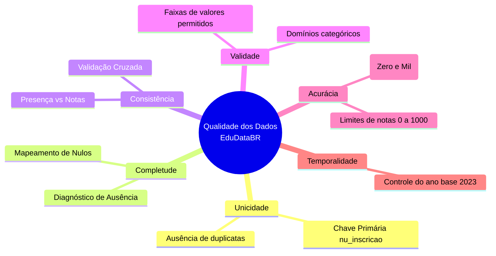

# 🛡️ Avaliação da Qualidade dos Dados (Data Quality) — EduDataBR

## 1. Objetivo

Este documento formaliza a avaliação de **Qualidade dos Dados (Data Quality Management - DQM)** do projeto **EduDataBR**, orientada pelos princípios do framework **DAMA-DMBOK**.

A finalidade é auditar rigorosamente os 3.933.955 registros da base intermediária (`microdados_enem_2023_reduzido.csv`), documentar inconsistências, validar domínios e definir premissas inegociáveis para as etapas subsequentes de limpeza, engenharia de atributos e modelagem.

---

## 2. Dimensões de Qualidade Avaliadas

---

## 3. Resultados da Auditoria de Qualidade

Auditoria realizada diretamente sobre a base total de **3.933.955 registros**.

### 3.1 Unicidade (Chave Primária)
- **Variável avaliada:** `NU_INSCRICAO`
- **Duplicatas identificadas:** **0 registros** (100% de unicidade).
- **Conclusão:** `NU_INSCRICAO` é perfeitamente adequada como identificador unívoco dos participantes no banco relacional PostgreSQL.

---

### 3.2 Completude (Análise de Valores Ausentes)

| Coluna | Total de Registros | Preenchidos | Nulos | % Ausente | Classificação do Dado |
|---|---:|---:|---:|---:|:---:|
| `NU_INSCRICAO` | 3.933.955 | 3.933.955 | 0 | 0,00% | Completo |
| `NU_ANO` | 3.933.955 | 3.933.955 | 0 | 0,00% | Completo |
| `TP_FAIXA_ETARIA` | 3.933.955 | 3.933.955 | 0 | 0,00% | Completo |
| `TP_SEXO` | 3.933.955 | 3.933.955 | 0 | 0,00% | Completo |
| `TP_COR_RACA` | 3.933.955 | 3.933.955 | 0 | 0,00% | Completo |
| `SG_UF_PROVA` | 3.933.955 | 3.933.955 | 0 | 0,00% | Completo |
| `TP_ESCOLA` | 3.933.955 | 3.933.955 | 0 | 0,00% | Completo |
| `TP_PRESENCA_CN` | 3.933.955 | 3.933.955 | 0 | 0,00% | Completo |
| `TP_PRESENCA_CH` | 3.933.955 | 3.933.955 | 0 | 0,00% | Completo |
| `TP_PRESENCA_LC` | 3.933.955 | 3.933.955 | 0 | 0,00% | Completo |
| `TP_PRESENCA_MT` | 3.933.955 | 3.933.955 | 0 | 0,00% | Completo |
| `NU_NOTA_CN` | 3.933.955 | 2.692.427 | 1.241.528 | **31,56%** | Ausência Estrutural |
| `NU_NOTA_CH` | 3.933.955 | 2.822.643 | 1.111.312 | **28,25%** | Ausência Estrutural |
| `NU_NOTA_LC` | 3.933.955 | 2.822.643 | 1.111.312 | **28,25%** | Ausência Estrutural |
| `NU_NOTA_MT` | 3.933.955 | 2.692.427 | 1.241.528 | **31,56%** | Ausência Estrutural |
| `NU_NOTA_REDACAO` | 3.933.955 | 2.822.643 | 1.111.312 | **28,25%** | Ausência Estrutural |
| `Q006` | 3.933.955 | 3.933.955 | 0 | 0,00% | Completo |
| `Q025` | 3.933.955 | 3.933.955 | 0 | 0,00% | Completo |

> **Achado Crítico:** 100% dos dados cadastrais, demográficos, geográficos e socioeconômicos estão integralmente preenchidos. A presença de valores nulos restringe-se exclusivamente às notas das provas.

---

### 3.3 Consistência Lógica (Presença vs. Notas)

Para garantir que os nulos nas notas não fossem anomalias de extração ou falha de banco de dados, realizou-se a validação cruzada condicional entre presença e nota:

| Regra de Consistência | Cenário Inválido | Ocorrências Observadas | Diagnóstico |
|---|---|---:|:---:|
| **Presente com Nota Ausente** | `TP_PRESENCA == 1` e `NU_NOTA IS NULL` | **0** | Aprovado ✅ |
| **Ausente com Nota Preenchida** | `TP_PRESENCA != 1` e `NU_NOTA IS NOT NULL` | **0** | Aprovado ✅ |

**Conclusão Estatística:** A ausência de dados nas notas é do tipo **MNAR (Missing Not at Random)**, causada de forma causal e determinística pelo não comparecimento ou eliminação do candidato. 

> ⚠️ **Decisão Técnica de Governança:** É **terminantemente proibido imputar** valores ausentes de notas (por média, mediana ou modelos preditivos) para participantes faltosos, pois isso atribuiria desempenho a quem não realizou a prova, falseando a realidade educacional.

---

### 3.4 Validade de Domínios

Todos os valores observados nos 3,93M de registros foram comparados contra as regras de negócio oficiais:

| Variável | Domínio Esperado | Domínio Observado na Base | Inconsistências | Status |
|---|---|---|---:|:---:|
| `TP_SEXO` | `['M', 'F']` | `['M', 'F']` | 0 | Válido ✅ |
| `TP_COR_RACA` | `[0, 1, 2, 3, 4, 5]` | `[0, 1, 2, 3, 4, 5]` | 0 | Válido ✅ |
| `TP_FAIXA_ETARIA` | `1` a `20` | `1` a `20` | 0 | Válido ✅ |
| `TP_ESCOLA` | `[1, 2, 3]` | `[1, 2, 3]` | 0 | Válido ✅ |
| `SG_UF_PROVA` | 27 UFs válidas brasileiras | 27 UFs oficiais | 0 | Válido ✅ |
| `Q006` (Renda) | `['A'..'Q']` (17 categorias) | `['A'..'Q']` | 0 | Válido ✅ |
| `Q025` (Internet) | `['A', 'B']` | `['A', 'B']` | 0 | Válido ✅ |
| `NU_ANO` | `[2023]` | `[2023]` | 0 | Válido ✅ |

---

### 3.5 Acurácia e Conformidade das Notas

Verificação das notas preenchidas quanto aos limites teóricos e identificação de valores extremos:

| Prova | Mínimo | Máximo | Notas < 0 | Notas > 1000 | Notas Zero (`0,0`) | Notas Mil (`1000,0`) |
|---|---:|---:|---:|---:|---:|---:|
| `NU_NOTA_CN` | 0,0 | 868,4 | 0 | 0 | 16.547 | 0 |
| `NU_NOTA_CH` | 0,0 | 823,0 | 0 | 0 | 5.612 | 0 |
| `NU_NOTA_LC` | 0,0 | 820,8 | 0 | 0 | 2.169 | 0 |
| `NU_NOTA_MT` | 0,0 | 958,6 | 0 | 0 | 16.638 | 0 |
| `NU_NOTA_REDACAO` | 0,0 | 1000,0 | 0 | 0 | 117.829 | **60** |

#### Interpretação dos Extremos:
1. **Conformidade de Intervalo:** Não existem notas espúrias negativas ou acima da pontuação máxima estabelecida pelo INEP.
2. **TRI nas Provas Objetivas:** As notas máximas refletem a escala da Teoria de Resposta ao Item para o ENEM 2023 (onde a maior nota possível em Matemática foi 958,60 e em Linguagens foi 820,80).
3. **Notas Zero na Redação:** As **117.829** notas zero na redação decorrem de critérios objetivos do edital (folha em branco, fuga total ao tema, extensão insuficiente, cópia de texto motivador ou impropérios).
4. **Notas Mil na Redação:** Apenas **60 participantes** no Brasil atingiram a nota máxima de 1000 pontos na redação em 2023, demonstrando a seletividade e calibração correta da base.

---

## 4. Regras de Tratamento para a Etapa de Limpeza (Sprint 4)

Com base nos diagnósticos levantados, definem-se as seguintes regras de negócio para processamento no notebook `02_limpeza_tratamento.ipynb`:

### Regra 1: Particionamento das Bases de Análise
Para evitar vieses amostrais, o projeto trabalhará com duas visões complementares:
- **Visão 1 — Base Populacional de Inscrições ($N = 3.933.955$):**
  - Utilizada para estudos de perfil demográfico, socioeconômico geral e análises de absenteísmo/evasão entre os dias de prova.
- **Visão 2 — Base Analítica de Desempenho / Complete Cases ($N \approx 2.692.427$):**
  - Restrita aos participantes presentes em **todas** as provas (`TP_PRESENCA_CN == 1` E `TP_PRESENCA_CH == 1` E `TP_PRESENCA_LC == 1` E `TP_PRESENCA_MT == 1`).
  - Utilizada para análises correlacionais, distribuições de notas, comparativos público/privado e treinamento de Machine Learning.

### Regra 2: Otimização de Tipos de Dados em Memória
Para viabilizar processamento rápido em computadores pessoais e notebooks:
- Converter `NU_INSCRICAO` para `string` ou `int64`.
- Converter `TP_SEXO`, `SG_UF_PROVA`, `Q006` e `Q025` para o tipo `category` do Pandas.
- Converter `TP_FAIXA_ETARIA`, `TP_COR_RACA`, `TP_ESCOLA` e `TP_PRESENCA_*` para inteiros compactos (`int8`).
- Converter notas para ponto flutuante de precisão simples (`float32`).
- Exportar a base tratada em formato colunar **Apache Parquet** (`.parquet`), garantindo leitura até 10x mais rápida e redução drástica no consumo de disco.

---

## 5. Histórico de Auditorias

| Data | Auditor | Escopo | Resultado |
|---|---|---|---|
| 2026-09-21 | Pair Programming (Antigravity & Gustavo) | Auditoria integral das 18 colunas dos 3,93M de registros | Integridade 100% confirmada; nulos mapeados estritamente à presença; zero anomalias de domínio. |
