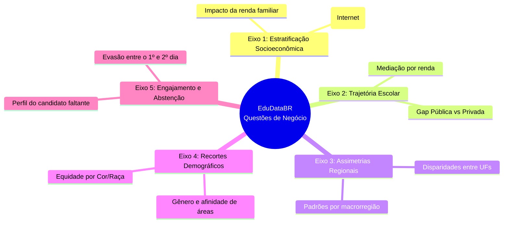

# 🎯 Perguntas de Negócio — EduDataBR

## 1. Objetivo

Este documento estabelece as **Perguntas de Negócio (Analytical Business Questions)** que orientam todas as etapas do projeto **EduDataBR**. 

O objetivo é garantir que cada consulta em SQL, análise exploratória em Python, engenharia de atributos e modelo preditivo responda a um problema analítico concreto com relevância para a educação brasileira e valor para tomada de decisão baseada em dados.

---

## 2. Visão Geral dos Eixos Analíticos

As perguntas estão estruturadas em **5 eixos temáticos**:

---

## 3. Catálogo de Perguntas de Negócio

---

### 🔹 Eixo 1 — Estratificação Socioeconômica e Inclusão Digital

#### **PQ1: Qual é o impacto da renda familiar mensal no desempenho médio das 5 provas do ENEM?**
- **Contexto:** A renda familiar (`Q006`) é o indicador mais consolidado de poder aquisitivo nos microdados.
- **Variáveis Envolvidas:** `q006`, `nu_nota_cn`, `nu_nota_ch`, `nu_nota_lc`, `nu_nota_mt`, `nu_nota_redacao`.
- **Métricas:** Média aritmética, mediana, desvio padrão e amplitude interquartil (IQR) das notas por faixa de renda (`A` a `Q`).
- **Artefatos Associados:** `sql/queries/04_desempenho_por_renda.sql`, `notebooks/03_analise_exploratoria.ipynb`.
- **Tomada de Decisão / Insight:** Medir a amplitude do abismo educacional entre extremos socioeconômicos e verificar se a relação de progressão é linear.

#### **PQ2: O acesso à internet domiciliar promove um ganho de desempenho independente da renda da família?**
- **Contexto:** A exclusão digital limita o acesso a videoaulas, plataformas de simulados e materiais didáticos de apoio.
- **Variáveis Envolvidas:** `q025`, `q006`, `nu_nota_*`.
- **Métricas:** Diferença de médias ($Δ\mu$) controlada por extrato de renda (ex.: candidatos da faixa `B` com internet vs. candidatos da faixa `B` sem internet).
- **Artefatos Associados:** `sql/queries/05_desempenho_acesso_internet.sql`, `notebooks/03_analise_exploratoria.ipynb`.
- **Tomada de Decisão / Insight:** Isolar o efeito específico da conectividade como ferramenta de mitigação de desigualdade.

---

### 🔹 Eixo 2 — Trajetória Escolar: Rede Pública vs. Privada

#### **PQ3: Qual é o tamanho real do gap educacional entre participantes oriundos da rede pública e da rede privada? Em qual prova essa distância é mais crítica?**
- **Contexto:** Historicamente, estudantes de escolas privadas contam com maior carga horária preparatória específica para vestibulares.
- **Variáveis Envolvidas:** `tp_escola` (códigos `2` e `3`), `nu_nota_cn`, `nu_nota_ch`, `nu_nota_lc`, `nu_nota_mt`, `nu_nota_redacao`.
- **Métricas:** Média de notas, percentis 25, 50 e 75, diferença percentual e absoluta por prova.
- **Artefatos Associados:** `sql/queries/03_escola_publica_privada.sql`, `notebooks/03_analise_exploratoria.ipynb`.
- **Tomada de Decisão / Insight:** Identificar se o gargalo da escola pública é predominantemente em redação (competência discursiva) ou matemática (raciocínio quantitativo).

#### **PQ4: O diferencial de desempenho da escola privada persiste quando comparamos alunos de mesma faixa de renda?**
- **Contexto:** Alunos de escolas particulares frequentemente vêm de famílias com maior poder aquisitivo. É necessário verificar se a vantagem é da instituição ou do capital financeiro e cultural da família.
- **Variáveis Envolvidas:** `tp_escola`, `q006`, `nu_nota_*`.
- **Métricas:** Médias comparadas em tabela cruzada (`TP_ESCOLA` $\times$ `Q006`).
- **Artefatos Associados:** `notebooks/03_analise_exploratoria.ipynb`, modelos de regressão na Sprint 5.

---

### 🔹 Eixo 3 — Assimetrias Geográficas e Desempenho Regional

#### **PQ5: Como o desempenho médio se distribui geograficamente entre as 27 Unidades da Federação e as 5 Regiões?**
- **Contexto:** O Brasil apresenta profundas assimetrias históricas de investimento público e infraestrutura entre regiões.
- **Variáveis Envolvidas:** `sg_uf_prova`, `nu_nota_*`.
- **Métricas:** Ranking de estados por média geral e por área, mapas coropléticos de médias estaduais.
- **Artefatos Associados:** `sql/queries/02_notas_por_estados.sql`, `app/streamlit_app.py`.
- **Tomada de Decisão / Insight:** Mapear polos de excelência (ex.: desempenho do Ceará em exatas) e regiões prioritárias para políticas de reforço educacional.

---

### 🔹 Eixo 4 — Recortes Demográficos e Equidade

#### **PQ6: Existem disparidades sistemáticas de desempenho segundo o sexo declarado dos participantes? Em quais disciplinas elas se manifestam?**
- **Contexto:** Estudos internacionais apontam diferenças de engajamento e incentivo precoce entre áreas STEM (ciências exatas) e linguagens/humanidades.
- **Variáveis Envolvidas:** `tp_sexo`, `nu_nota_cn`, `nu_nota_ch`, `nu_nota_lc`, `nu_nota_mt`, `nu_nota_redacao`.
- **Métricas:** Distribuição das médias, testes de significância e densidade de probabilidade (KDE).
- **Artefatos Associados:** `notebooks/03_analise_exploratoria.ipynb`.

#### **PQ7: Como a variável cor/raça se correlaciona com as notas e qual é o grau de sobreposição com a vulnerabilidade socioeconômica?**
- **Contexto:** Avaliação da equidade étnico-racial no acesso ao ensino superior via notas do ENEM.
- **Variáveis Envolvidas:** `tp_cor_raca`, `q006`, `nu_nota_*`.
- **Métricas:** Médias por grupo autodeclarado (Branca, Preta, Parda, Amarela, Indígena) e cruzamento bivariado com a renda familiar.
- **Artefatos Associados:** `notebooks/03_analise_exploratoria.ipynb`.

---

### 🔹 Eixo 5 — Engajamento, Presença e Abstenção

#### **PQ8: Qual é o perfil dos participantes que faltam ao exame ou abandonam a prova entre o primeiro e o segundo dia?**
- **Contexto:** Mais de 31% dos inscritos não compareceram ao segundo dia do ENEM 2023. A abstenção representa desperdício de recursos públicos e frustração da trajetória educacional.
- **Variáveis Envolvidas:** `tp_presenca_*`, `tp_faixa_etaria`, `q006`, `q025`, `sg_uf_prova`, `tp_escola`.
- **Métricas:** Taxa de abstenção por dia (% de faltosos e eliminados) fatiada por UF, renda e tipo de escola.
- **Artefatos Associados:** `notebooks/02_limpeza_tratamento.ipynb`, `app/streamlit_app.py`.
- **Tomada de Decisão / Insight:** Identificar os grupos demográficos em maior risco de evasão no exame.

---

## 4. Matriz de Rastreabilidade

| Pergunta | Variáveis Chave | Técnica Analítica | Entregável Principal |
|:---:|---|---|---|
| **PQ1** | `Q006`, notas | Agrupamento SQL & Boxplots | Query 04 / Notebook 03 |
| **PQ2** | `Q025`, `Q006`, notas | Análise estratificada | Query 05 / Notebook 03 |
| **PQ3** | `TP_ESCOLA`, notas | Comparações de média & IQR | Query 03 / Notebook 03 |
| **PQ4** | `TP_ESCOLA`, `Q006`, notas | Regressão multivariada | Notebook 04 (ML) |
| **PQ5** | `SG_UF_PROVA`, notas | Ranking & Mapas coropléticos | Query 02 / Streamlit App |
| **PQ6** | `TP_SEXO`, notas | Curvas de densidade e médias | Notebook 03 |
| **PQ7** | `TP_COR_RACA`, `Q006`, notas | Análise de equidade | Notebook 03 |
| **PQ8** | `TP_PRESENCA_*`, demografia | Taxas de conversão e evasão | Notebook 02 & Streamlit |
