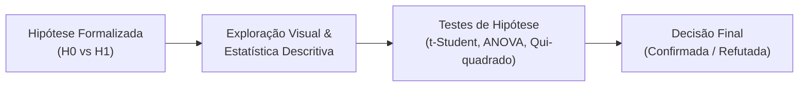

# 🧪 Hipóteses Analíticas — EduDataBR

## 1. Objetivo

Este documento registra as **hipóteses formuladas a priori** para o projeto **EduDataBR**, antes do aprofundamento das análises exploratórias e da modelagem preditiva.

Formular hipóteses testáveis e falseáveis evita o *p-hacking* (torturar os dados até confessarem algo) e confere rigor científico e analítico ao portfólio, demonstrando raciocínio estruturado, formulação de hipótese nula ($H_0$) e hipótese alternativa ($H_1$), e critérios objetivos de validação.

---

## 2. Metodologia de Validação das Hipóteses

Cada hipótese será submetida ao seguinte fluxo de validação:

1. **Hipótese Nula ($H_0$):** Afirmação padrão de que não há efeito, relação ou diferença significativa entre os grupos.
2. **Hipótese Alternativa ($H_1$):** A proposição que o projeto busca evidenciar a partir dos dados.
3. **Nível de Significância Adotado:** $\alpha = 0,05$ (95% de confiança estatística).
4. **Critério de Decisão:** Rejeita-se $H_0$ quando o p-valor for menor que $0,05$ e o tamanho do efeito (*effect size*) for substantivo.

---

## 3. Catálogo de Hipóteses

---

### 🔹 Hipótese 1: Gradiente Socioeconômico e Desempenho Monotônico

- **Fundamentação Teórica:** Alunos de famílias com maior poder aquisitivo dispõem de melhores condições materiais de estudo (ambiente individual, cursinhos preparatórios, livros, alimentação e estabilidade emocional).
- **$H_0$ (Nula):** A renda familiar mensal (`Q006`) não apresenta correlação significativa com as notas médias dos participantes.
- **$H_1$ (Alternativa):** As notas médias de todas as provas crescem de forma monotônica conforme a elevação da faixa de renda familiar (`Q006`), sendo a prova de **Matemática** a disciplina com maior amplitude entre os extremos (`A` vs `Q`).
- **Métricas e Testes:**
  - Coeficiente de correlação de postos de Spearman ($\rho$).
  - Amplitude absoluta ($Δ = \mu_Q - \mu_A$).
  - ANOVA One-Way para verificar se as diferenças entre faixas são estatisticamente significativas ($p < 0,001$).
- **Critério de Confirmação:** $\rho > 0,80$, diferença média de Matemática entre faixas extremas superior a 200 pontos e $p < 0,05$.

---

### 🔹 Hipótese 2: O Efeito Isolado da Inclusão Digital

- **Fundamentação Teórica:** A disponibilidade de internet domiciliar viabiliza o acesso a recursos didáticos complementares, canais educacionais e videoaulas, atenuando desvantagens mesmo em lares de baixa renda.
- **$H_0$ (Nula):** O acesso à internet domiciliar (`Q025`) não produz diferença de desempenho estatisticamente relevante quando comparamos candidatos pertencentes ao mesmo estrato salarial.
- **$H_1$ (Alternativa):** Candidatos com acesso à internet em casa apresentam notas médias significativamente superiores às de candidatos sem internet, mesmo mantendo constante a faixa de renda familiar.
- **Métricas e Testes:**
  - Teste t de Student para duas amostras independentes dentro de cada estrato de renda (especialmente faixas `A`, `B` e `C`).
  - Cálculo do tamanho do efeito ($d$ de Cohen).
- **Critério de Confirmação:** Médias de notas de candidatos conectados superam as dos desconectados em pelo menos 15 pontos em Matemática e Redação na mesma faixa de renda com $p < 0,05$.

---

### 🔹 Hipótese 3: Assimetria Estrutural entre Redes de Ensino (Pública vs. Privada)

- **Fundamentação Teórica:** O investimento por aluno, infraestrutura pedagógica e direcionamento curricular para o modelo do ENEM diferem substancialmente entre as escolas da rede privada e a rede pública regular.
- **$H_0$ (Nula):** Não existe diferença estatisticamente significativa no desempenho médio entre concluintes de escolas públicas e privadas.
- **$H_1$ (Alternativa):** Estudantes da rede privada superam os da rede pública em todas as áreas do conhecimento, com a maior disparidade concentrada nas provas de **Redação** e **Matemática**.
- **Métricas e Testes:**
  - Teste t de Welch (amostras independentes com variâncias desiguais).
  - Análise de percentis (P25, P50, P75).
- **Critério de Confirmação:** Diferença de médias ($Δ\mu = \mu_{\text{privada}} - \mu_{\text{pública}}$) superior a 100 pontos em Redação e Matemática com $p < 0,001$.

---

### 🔹 Hipótese 4: Disparidades de Gênero por Domínio do Conhecimento

- **Fundamentação Teórica:** Barreiras culturais e estímulos pedagógicos históricos criam disparidades de desempenho associadas a gênero, com maior estímulo masculino em ciências exatas e incentivo à leitura/escrita em perfis femininos.
- **$H_0$ (Nula):** As médias de desempenho de participantes do sexo masculino e feminino são estatisticamente idênticas em todas as 5 provas.
- **$H_1$ (Alternativa):** Participantes do sexo feminino obtêm médias superiores em Redação e Linguagens, enquanto participantes do sexo masculino obtêm médias superiores em Matemática e Ciências da Natureza.
- **Métricas e Testes:**
  - Comparação de médias amostrais e intervalos de confiança de 95% para a diferença das médias ($IC_{95\%}$).
  - Teste t de Student para amostras independentes.
- **Critério de Confirmação:** Rejeição de $H_0$ com $p < 0,05$ e intervalos de confiança de 95% sem intersecção entre os gêneros nas disciplinas apontadas.

---

### 🔹 Hipótese 5: Polarização Geográfica e Polos de Excelência Regional

- **Fundamentação Teórica:** A concentração de renda e escolas de alta performance nas regiões Sudeste e Sul reflete-se nas médias do ENEM, porém iniciativas pedagógicas estaduais específicas produzem polos de excelência fora desse eixo.
- **$H_0$ (Nula):** O desempenho médio por estado é uniforme e varia apenas por flutuação aleatória.
- **$H_1$ (Alternativa):** Estados do Sudeste e Sul dominam o topo do ranking de médias gerais, mas estados do Nordeste (especificamente o Ceará) despontam com desempenho acima da média nacional em Matemática.
- **Métricas e Testes:**
  - Análise de variância (ANOVA) inter-regional.
  - Z-Score de desempenho estadual em relação à média brasileira.
- **Critério de Confirmação:** Média do Ceará em Matemática superior à média nacional brasileira ($p < 0,05$) em meio a um quadro onde o Sudeste lidera o ranking agregado.

---

### 🔹 Hipótese 6: Determinantes da Evasão entre os Dias de Prova

- **Fundamentação Teórica:** O custo de deslocamento para dois domingos consecutivos, somado ao sentimento de desvantagem ou frustração após o primeiro dia, afeta desproporcionalmente participantes em situação de vulnerabilidade.
- **$H_0$ (Nula):** A taxa de abstenção no 2º dia de exame independe do nível socioeconômico do participante.
- **$H_1$ (Alternativa):** A probabilidade de comparecer no 1º dia e abandonar o 2º dia é significativamente mais alta entre participantes de menor renda (`Q006`) e sem internet (`Q025`).
- **Métricas e Testes:**
  - Teste de Qui-Quadrado de Independência ($\chi^2$).
  - Razão de Chances (*Odds Ratio* - OR).
- **Critério de Confirmação:** $\chi^2$ com $p < 0,001$ e *Odds Ratio* de evasão no 2º dia pelo menos 1,5x maior para as classes `A` e `B` em relação às classes `P` e `Q`.

---

## 4. Matriz de Acompanhamento das Hipóteses

| ID | Hipótese | Variáveis Testadas | Etapa de Teste | Status Atual |
|:---:|---|---|:---:|:---:|
| **H1** | Gradiente de Renda Monotônico | `Q006`, notas | SQL / EDA | ⏳ A Testar |
| **H2** | Efeito Isolado da Inclusão Digital | `Q025`, `Q006`, notas | EDA / SQL | ⏳ A Testar |
| **H3** | Gap Pública vs. Privada | `TP_ESCOLA`, notas | SQL / EDA | ⏳ A Testar |
| **H4** | Assimetria de Gênero por Disciplina | `TP_SEXO`, notas | EDA | ⏳ A Testar |
| **H5** | Polarização Regional & Polos de Exatas | `SG_UF_PROVA`, notas | SQL / EDA | ⏳ A Testar |
| **H6** | Determinantes da Evasão do 2º Dia | `TP_PRESENCA_*`, `Q006`, `Q025` | Limpeza / EDA | ⏳ A Testar |
